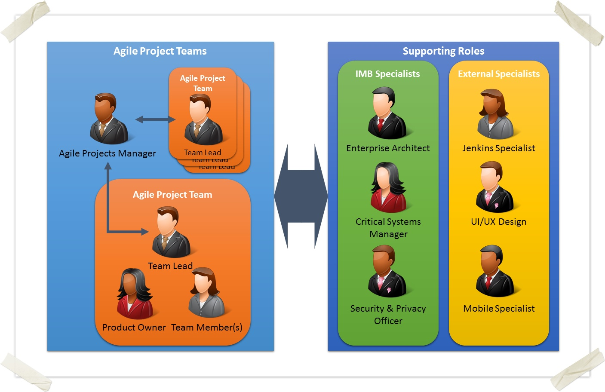
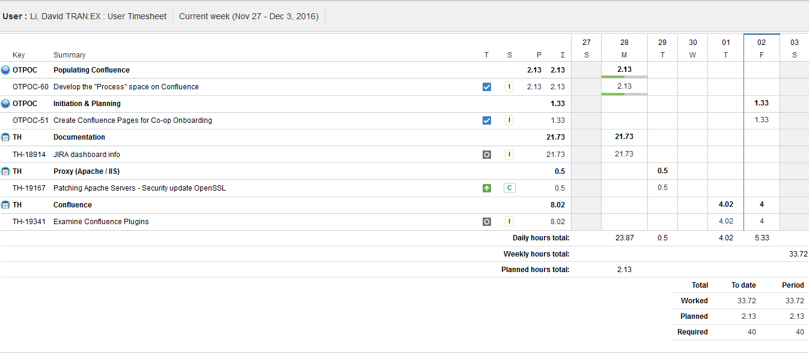

[ ]{}

940 Blanshard Street\
Victoria, British Columbia\
V8W 3E6\
Susan Fiddler\
Co-op Coordinator\
Faculty of Engineering\
University of Victoria\
P.O. Box 1700\
Victoria, B.C.\
V8W 2Y2\
September 4, 2001\
Dear Susan, Please accept the accompanying Work Term Report entitled
“Determining uses of and at MOTI IMB.”\
This report is the result of work completed at the Ministry of
Transportation and Infrastructure Information Management Branch,
Government of British Columbia. During my first work term as a
University of Victoria student, I used charts and tables to display
information about , complied documentation for critical applications in
a and researched add-ons to extend functionality. In the course of work,
I gained exposure to a technical environment, and learned how software
can integrate together.\
Through the course of the term, I was given the opportunity to learn
much software development, testing applications, and software products.
I feel that this knowledge will be helpful in future work terms, and in
my career.\
I would like to thank my manager, Phillip Svehla, for his patience and
good judgement, as well as the Client Services who were always willing
to help. Sincerely,\
\
David Li

Summary  {#summary .unnumbered}
========

In the continuing effort to organize high-quality reliable information,
the is presently experimenting with , an tracking tool and , software
for technical documentation. Although good quality information is
critical to operations, is inconsistent and scattered across multiple
sources, some of which require access permissions. and Confluence are
software tools that improve productivity and organization within MOTI
IMB.\
\
Benefits from connecting and include common user management, reporting
on existing JIRA in and switching between application quickly. Extending
the functionality of these tools by installing add-ons will assist in
improving . Purchasing software such as to solve the problem is
inadequate because software can be poorly designed or implemented. These
software tools assist in information management, but full utilization
and proper implementation is required to improve documentation.

Introduction
============

The (MOTI) is responsible for transportation services, infrastructure
and formulates transportation policies. The strives to empower the to
achieve effective use of and greatest benefit from information
technology management.\

{width="1\linewidth"}

The oversees and maintains over 100 applications for . Older
applications usually are inconsistently documented and new staff
confront difficulties obtaining working knowledge of systems. Creating a
that contains all information of about every system involves
considerable effort, but will greatly simplify workflow. Consequently,
managing overwhelming and outdated amounts of information and create a
single location for all information about an application. Gathering
knowledge of database servers, contact information, applications urls
and documentation links demands widespread cooperation and
communication.\
\
Atlassian, an enterprise software company, produces software tools
including and Confluence for team collaboration, software development
and organization. At MOTI IMB, enterprise software is used for issue
tracking, project management and organize content. Currently,
information is scattered across LAN DRIVES, Sites and other sources that
work for small groups of people. Going forward, using enterprise
software such as JIRA and Confluence is essential to manage projects and
their issues throughout the software development lifecycle.\
\
Inspecting the capabilities of JIRA and Confluence is helpful to
streamlining the adoption of these versatile software products. While
JIRA offers flexible issue tracking and project management, Confluence
is wiki software used for technical documentation that locates
information quickly and easily. Improving and standardizing
documentation for applications requires methodically examining software
capabilities. Criteria include functionality, compatibility, ease of
use, strategic purpose and integration with existing software. Switching
to JIRA has reduced email volume, improved customer support and
simplified project management. Currently, the use Confluence restricted
to selected individuals. Analysing the potential uses of Confluence and
JIRA will provide insight on how to better use these new tools.

Discussion
==========

Oftentimes, tacit information is trapped within emails, but using and
together will capture this information forever. In addition, and have
permissions to give flexibility to decide who can view and edit content.

JIRA
----

Embracing JIRA two years ago enhanced productivity at the , but
insufficient guidance on how to use the system caused grievances. Before
JIRA Microsoft SharePoint, a document management system was used to
“store, organize, share, and access information” [@sharepoint:Online].
An issue in JIRA is used to create, track and resolve reported client
issues. MOTI IMB employees use JIRA on a daily basis, so an “issue could
represent a software bug, a project task, a helpdesk ticket, etc.”
[@issueDefinition:Online]. For example, Client Services provides
technical support for the MOTI and reporters email tranit@gov.bc.ca,
then a JIRA issue is automatically created, placed in queue and
eventually assigned to service desk analysts.\
\
JIRA is highly customizable, organized by projects, components, versions
and labels. The most flexible way to search for issues is by
constructing JQL (JIRA Query Languages) filters that use issue fields,
operators, values and keywords and return specified JIRA issues. JIRA
has spilt into 3 different standalone products JIRA Core, JIRA software,
and JIRA Service Desk. Designed for managing projects and tasks, JIRA
Core keeps team organized. JIRA Software allows for Agile boards and
integrates with software development tools. JIRA Service Desk is IT
service desk and customer service software. JIRA incorporates time
tracking, reporting features and is enhanced by installing add-ons such
as ScriptRunner and Tempo Timesheets. Despite regular use of JIRA at
MOTI IMB, its extensive functionality and plethora of features will
confuse newcomers.

### Overview

Although JIRA originated as a software tool geared towards developers,
it has evolved to address the needs of the non-technical users. can
track issues, display information on a dashboard and manage projects by
using or Boards which are designed to manage software projects. JIRA
permissions are setting that limit what users can see and do. JIRA’s
permission scheme includes editing issues, creating issues, commenting,
assigning issues, etc. [@PermissionsOverview:Online]. Generally, users
are added to an JIRA project, begin searching for issues, close and
repeat.

### Issues

An contains multiple fields including type, priority, component, status,
resolution, description assignee and reporter. It contains information
indicating the urgency and current status of the issue. Some of the
options available for issue status field include new, to-do, in
progress, hold, and closed. Issue priorities vary from trivial to
blocker. Classifying issues correctly is essential for users to document
their work and reference in the future. Issues can have subtasks, be
duplicated or be related to other existing issues. Watching an issue
notified the user when the issue is commented, status changed, closed,
or updated.

{width="1\linewidth"}

When the status of an issue is changed or closed the reporter will
receive an email update. Time tracking in is accomplished by creating a
work log, entering time spent, giving a reasonable remaining estimate
and description of work done. Oftentimes, issues are reassigned to
assignees better suited to complete the task. Attachments can be added
to the issue to better describe work that needs to be done. Previously
at IMB, for each application a Microsoft site would be created, and
issue tracking was managed by creating list items. Even though this
worked for small groups, providing access to each individual SharePoint
site was cumbersome and time-consuming for everybody. A single system
that contains issues for all projects benefits all users and has become
essential to day-to-day operations.\
Issues in JIRA can be imported or exported to and from xls files, which
allows the user to reuse content from fabricated in other applications.
Overall, JIRA issues can represent anything ranging from software bugs,
to an access request and used for project management.

### Dashboards

JIRA dashboards contains information boxes known as gadgets that can
display dynamic data about a JIRA filter or project. Gadgets let you
customize the information that appears on dashboards. Configuring
dashboards allows different kinds of information to be displayed. Most
of these gadgets require JIRA filters to feed information into it.
Dashboards can display filter results, issue statistics, pie charts
grouped by a specified issue field such as created, assignee, status,
and priority. Add-ons for JIRA should as Zephyr (used for test
management) and Tempo Timesheets (creates timesheets for JIRA issues)
are packaged with dashboard gadgets containing additional information
specific to that add on. An example is the user timesheet add-on from
tempo which displays a timesheet for a specific period of time.\

{width="1\linewidth"}

At this time, dashboard usage is inconsistent, and undergoing further
investigation. Ideally, every project and every team would have a JIRA
dashboard, customized to suit their individual needs.

Also, has adaptable and boards to track issue backlogs. These boards can
be displayed on a JIRA dashboard. Creating a meaningful dashboards faces
several obstacles including understanding of the JIRA specific query
language, , knowledge of which dashboard gadget is suitable and a steep
learning curve.\
Developing an informative dashboard entails consulting with the end
users, multiple iterations and producing JIRA filters.

{width="1\linewidth"}

Dashboards are the best method to visually reporting on ongoing and
completed issues in .

### Agile Projects in JIRA

Agile software development is used by the BC government to produce
software that better suits the needs of customers. In , requirements and
solutions develop through frequent conversations with stakeholders as
software is developed through collaboration. Two kinds of agile boards
are available in JIRA Agile, Kanban and Scrum. Each of these boards are
designed to follow their specific agile methodology. Adding the fix
version field to an issue will assign it to a particular release. All
released and unreleased versions can be viewed within the project
sidebar in JIRA. JIRA software provides tools specifically for any agile
project management which include boards, releases and dashboard gadgets
(burndown charts, velocity charts and more).

{width="1\linewidth"}

Altogether, JIRA is well-suited for project management with boards,
versioning and dashboard gadgets.

### Add-ons

JIRA add-ons provide additional functionality to JIRA including
increased customization and features.

Adaptavist ScriptRunner provides custom workflows, custom JQL and
executes scripts that interact with JIRA. Some notable features include
custom automatic emails triggered when an issue transitions into a
particular state, enhanced JIRA filters (i.e. searching for issues
attachments) and adding additional fields for JIRA issues. This add-on
provides a simple way to script in JIRA.\
Tempo timesheets enhances time tracking and reporting features while
faultlessly integrating with JIRA. It helps teams and managers track
time, be efficient and used for forecasting. This add-on is useful
because it allows JIRA users to accurate track their time spent on
issues, projects and make strategic decisions based on this info.\
The tempo time tracker runs within JIRA and is the best way track time.

{width="40.00000%"}

A user timesheet contains information about hours worked, planned, and
required for the week. It organizes issues automatically organizes
issues by project and component.

{width="100.00000%"}

### Limitations

JIRA can be extremely slow at times which may be caused by running out
of memory, and a large JIRA instance [@issues:Online]. Extensive
functionality such as time tracking, boards, dashboards and user
timesheets are underutilised because users unaccustomed to JIRA.
Additionally, a lack of tutorials or instructions are how to use JIRA
compound the difficult of learning how to use .

Confluence
----------

is team-based collaboration software developed by Atlassian used at the
to document projects and work in conjunction with . Confluence works by
It organizes content by labels, can embed videos on pages and is highly
customizable. The aim of Confluence is to become the tool for
organizing, discussing, and doing work. Assigning tasks, recording
meeting notes and sharing documents are some of the features of
Confluence.

### Overview

Confluence keeps page and file versions to track every version of
documents. Despite numerous free wiki-software available on the web,
Confluence has page hierarchy (page trees), transparency when creating
content and clean user interface which make it suitable for
documentation.

### Spaces

Everything in Confluence is organized in spaces, which are a collection
of related pages. Pages are the documents in which the team will create,
edit, and discuss work. Confluence Spaces are organized by categories
(i.e., critical non-critical, documentation and software-project).
Spaces can be customized to fit the need of each team. For example uses
of Confluence include knowledge bases, technical documentation and
organizing content [@confluence:Online].

### Pages

In a Confluence page, content is created, collected, and accessed in one
place.

{width="80.00000%"}

pages contain text, images, videos and uses macros that add extra
functionality or include dynamic content. Macros can create charts,
incorporate existing Microsoft documents (Word, Excel, PowerPoint) and
reuse content on Confluence pages. Existing templates in Confluence
serve as an excellent starting point for users to start creating
documentation for Confluence. Customizing page and space templates is an
essential feature to save time and reuse content.

### Embedding Content

Attachments are useful for sharing existing content saved in a different
file format.

{width="50.00000%"}

When word documents imported into Confluence, that document’s content is
copied onto one or more Confluence pages. Additionally, images and
videos from the web can be embedded into a Confluence Page. Sharing
links is convenient and helps users find information.

### Limitations

Confluence is designed for documentation, used by large organizations
including NASA [@NASA:Online], yet documenting legacy and current
projects in Confluence is not occurring at this moment. Currently, use
of Confluence is limited to few internal users, so education about this
software and its functionality lacking. Certain files types such as mpp
(Microsoft Project) and vsd (Microsoft Visio) cannot be embedded within
a Confluence Page, but can be uploaded as a file. Creating structured
space templates and pages will allow content to be streamlined.
Confluence functionality can be extending by downloading add-on in the
Atlassian marketplace. For example, tables in Confluence are
rudimentary, consisting only of ascending/descending sorting, however, a
few add-ons for Confluence address this problem.

JIRA and Confluence Integration
-------------------------------

Much like how Microsoft Office Products integrate well together, JIRA
and Confluence are better together. When and JIRA sites are connected
JIRA issues can be created, viewed and more from within Confluence.
Also, connecting JIRA with Confluence allows pie charts, created vs
resolved chart and filter results etc. Essentially, existing information
stored in JIRA can be reported in Confluence by the JIRA issues macro or
the JIRA charts macro [@JAC:Online].

{width="80.00000%"}

Another benefit from connecting JIRA to is delegated user management to
, so all users can be managed in a single location. Whenever a link is
created to a JIRA issue in Confluence, or link to a Confluence page from
a JIRA application, the JIRA Links button appears at the top of the
Confluence page. This makes it very simple to jump from JIRA straight
into Confluence and vice-versa.

{width="50.00000%"}

The tight integration between Confluence and JIRA results in related
issues can be accessed directly from the Confluence page with their
current status.

Conclusion
==========

Adopting JIRA has benefited by reducing response time, improving record
keeping and sharpening communication. Although JIRA has benefited the
organization by improving efficiency, lack of education resulting in
underutilisation of dashboards and filters, occasional performance
issues causing issue backlogs to pile up, and perceived unreliability
for sending emails. Agile software development methodologies such as
Scrum and Kanban are supported by the JIRA suite of applications. JIRA
has add-ons that extend functionality will complexity ranging from a
single feature to full product. Interestingly, when JIRA is integrated
with Confluence usage of both applications will increase because jumping
between application is quick and simple.\
\
In order to streamline the adoption of , usage intentions must be
conveyed as well as detailed guidance on how to use it. Confluence is
wiki software used to create knowledge bases, centralize information
into a single system and for technical documentation. Useful features of
Confluence include integration with , word processing, and team
collaboration. Connecting JIRA and Confluence applications allows enable
users to rapidly switch between applications. Overall, JIRA and
Confluence are software tools that improve productivity and organization
within MOTI IMB.

Recommendations
===============

Even though JIRA and Confluence are powerful software tools, failing to
grasp the full capabilities limits what can be done. Potential uses of
JIRA include issue management, project management and lengthy daily
activities that require documentation. Although there are multiple
issues types at this time, clear definitions for these issues and when
to use them are missing. Adding a wider range of types will allow JIRA
to be for a wider range of problems. Also, users are inconsistent in
their use of JIRA, failing to include details, documents or work
offline. Increasing understanding of how it works and guidance on when
to use it needed. Creating business rules on how and when to use JIRA
and Confluence will improve documentation consistency. Confluence should
be configured to support day to day JIRA activities at MOTI IMB.
Furthermore, research into the plethora of add-ons available for JIRA
and Confluence to see what functionality can be added.
